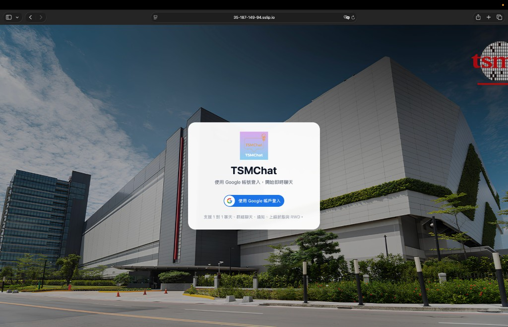
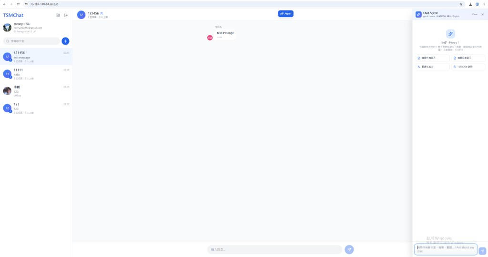
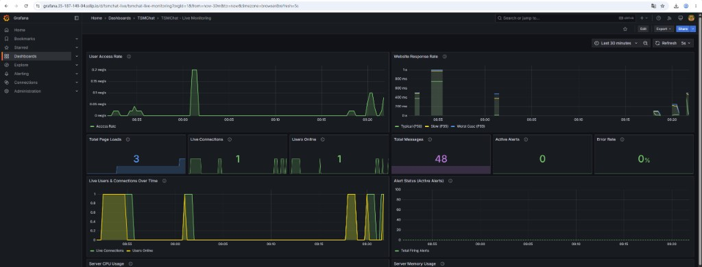
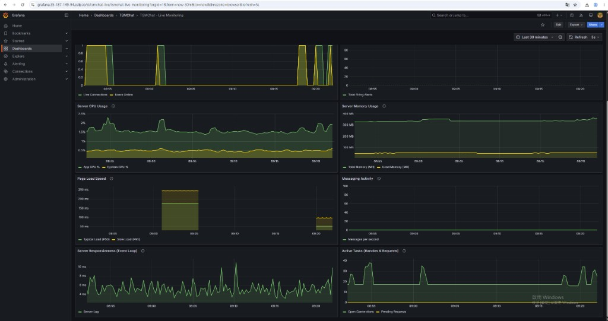

# TSMChat

**TSMChat** 是一套即時通訊平台，支援 Google 帳號登入、一對一與群組聊天、上線狀態顯示、未讀提醒、管理後台，以及內建 **Chat Agent**（OpenAI）。前端使用 React，後端使用 Node.js + Socket.IO，資料儲存於 PostgreSQL、Cassandra 與 Redis，並整合 Prometheus、Grafana 等監控工具。

---

## 線上服務連結

| 服務 | 網址 | 說明 |
|------|------|------|
| **TSMChat 網站** | https://35-187-149-94.sslip.io | 正式環境（GKE），HTTPS，使用 Google 帳號登入 |
| **Grafana 監控儀表板** | https://grafana.35-187-149-94.sslip.io | 儀表板：**TSMChat - Live Monitoring**；帳號 `admin` / 密碼 `tsmchat` |
| **Prometheus** | https://prometheus.35-187-149-94.sslip.io | 指標查詢 UI（HTTPS） |
| **GitHub 原始碼** | https://github.com/Chiushenhan/TSMChat | 複製專案、本地安裝與執行 |

> Google OAuth 請使用 **https://35-187-149-94.sslip.io**（不要用裸 IP）

---

## 功能展示

### 登入頁面

使用 Google 帳號登入後即可開始即時聊天。



### 聊天主畫面

支援搜尋聊天室、一對一與群組對話、上線狀態、未讀訊息標記，以及 Chat Agent 側欄。



### Grafana 監控儀表板

**TSMChat - Live Monitoring** 儀表板即時顯示流量、延遲、連線數、訊息量與錯誤率。



伺服器 CPU、記憶體、Event Loop 延遲與訊息活動等系統健康指標。



---

## 主要功能

- Google OAuth 登入
- 一對一與群組聊天室
- WebSocket（Socket.IO）即時訊息
- 僅在使用者**正在瀏覽 TSMChat 分頁**時顯示上線（綠點）
- 瀏覽器推播通知與未讀數 `(1)(2)…`
- 使用者可自訂 UID
- 管理員後台（使用者、群組、訊息、告警）
- **Chat Agent**（OpenAI `gpt-4.1-nano`）：可讀取所有 1v1 與群組聊天脈絡，支援摘要、翻譯與問答
- Prometheus + Grafana 監控（請求量、延遲、連線數、錯誤率等）

---

## 技術架構

```
React 前端 (Vite + Tailwind)
        │
        ▼
   Nginx / Ingress
        │
        ├── /api/*         → Express 後端
        ├── /socket.io/*   → Socket.IO
        ├── /metrics       → Prometheus 指標
        └── /*             → 靜態前端

後端連線：
    ├── PostgreSQL  → 使用者、聊天室、成員
    ├── Cassandra   → 訊息（高寫入）
    └── Redis       → 上線狀態、Socket 協調、Agent 用量

AI：
    └── OpenAI API  → Chat Agent（gpt-4.1-nano）

監控：
    ├── Prometheus + Grafana
    ├── Loki + Alloy（日誌）
    └── AlertManager（告警）
```

| 層級 | 技術 |
|------|------|
| 前端 | React 19、Vite、Tailwind CSS |
| 後端 | Node.js 24、Express、Socket.IO |
| AI | OpenAI Chat Agent |
| 驗證 | Google OAuth 2.0、JWT |
| 資料庫 | PostgreSQL 16、Cassandra 4.1、Redis 7 |
| 容器 | Docker |

---

## 本地安裝與執行

### 前置需求

- Node.js 24+
- 可連線的 PostgreSQL、Cassandra、Redis（見 `backend/.env.example`）
- [Google Cloud Console](https://console.cloud.google.com/) 建立 OAuth 2.0 用戶端 ID（網頁應用程式）
- Chat Agent 需設定 `OPENAI_API_KEY`

### 1. 複製專案

```bash
git clone https://github.com/Chiushenhan/TSMChat.git
cd TSMChat
```

### 2. 設定環境變數

```bash
cp backend/.env.example backend/.env
cp frontend/.env.example frontend/.env
```

編輯 `backend/.env` 與 `frontend/.env`，填入 **Google OAuth Client ID**；`backend/.env` 另需 **OPENAI_API_KEY**（若要用 Chat Agent）。

本地開發時，Google Console 需加入授權來源：

- `http://localhost`
- `http://localhost:5173`

### 3. 安裝依賴並啟動

**後端：**

```bash
cd backend
npm install
npm run dev
```

**前端（另開終端機）：**

```bash
cd frontend
npm install
npm run dev
```

開啟 http://localhost:5173

首次啟動需等待 PostgreSQL、Cassandra 就緒（約 1～2 分鐘）。

### 4. 本地存取連結

| 服務 | 網址 | 帳密 / 備註 |
|------|------|-------------|
| **TSMChat** | http://localhost:5173 | Google 登入 |
| **後端 API** | http://localhost:3000 | REST + WebSocket |

---

## 專案結構

```
TSMChat/
├── frontend/          # React 前端
├── backend/           # Node.js API + Socket.IO + Chat Agent
├── monitoring/        # Prometheus、Grafana、Loki 設定
└── docs/images/       # README 展示圖片
```

---

## 管理員後台

使用具管理員權限的 Google 帳號登入 TSMChat 後，可從側邊欄進入 **Admin Dashboard**，檢視：

- 線上使用者與系統指標
- 使用者 / 群組 / 訊息管理
- Prometheus 告警狀態

管理員權限請 email：henrychiu412@gmail.com

---

## 授權與貢獻

本專案創建於台積電授課雲端原生軟體開發清大課程，版權所有權第 20 組，歡迎提出任何建議與用戶回饋。
